<!-- Every graphic here is an image file (assets/ and generated/), so it renders and animates
     the same on github.com, mobile browsers and the GitHub app. -->

<a href="https://www.wland.online/Portfolios/Queen">
  
</a>

<p align="center">
  <a href="https://www.wland.online/Portfolios/Queen">
    
  </a>
</p>

<p align="center">
  <a href="https://www.wland.online/Portfolios/Queen"></a>
  <a href="https://www.wland.online/Portfolios/Queen#games"></a>
  <a href="https://www.wland.online/Portfolios/Queen#music"></a>
</p>

<p align="center">
  
  
  
</p>

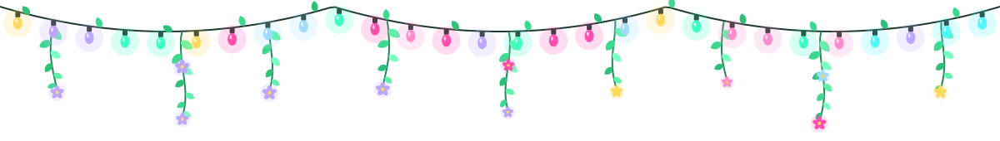

<p align="center"></p>

I started messing with code at **13**, got completely obsessed by **15**, and never looked back. Now in my early 30s with **16+ years** of experience, from scrappy teenage experiments to running a full **18+ empire**.

I'm the **Owner, CEO & Founder** of **WonderlandXXX Industries™**, a company I built entirely from scratch: networking, branding, community, subsidiaries and all.

I'm equally at home writing **novels across many genres** and growing a multi-level platform with diverse services. **TypeScript has my whole heart**, coffee is my daily hero, and the best deadline is the one that challenges me. Team player, but I prefer solo work: give me your scope, preferences and deadline, and I'll build something that makes you say *"I didn't know it could look like that."*

✨ Currently collaborating with **Modulix, powered by Chartis**: networking, growth and connectivity. I believe in better businesses and making even the smallest budget feel big. **No matter what you do, I can build your vision.**

<p align="center">
  
  
  
  
</p>

<details>
<summary><b>☕ Click to peek at my source code</b></summary>
<br />

```ts
const queen = {
  pronouns: "she/her",
  roles: ["Full-Stack Developer", "Game Developer", "Editor & Designer", "Writer & Author"],
  company: "WonderlandXXX Industries™ (Owner, CEO & Founder)",
  portfolio: "https://www.wland.online/Portfolios/Queen",
  loves: ["TypeScript ♥", "Three.js & 3D web", "browser games", "lofi", "rainy nights", "coffee"],
  currentlyLearning: ["Unity (C#)", "Verse / UEFN"],
  openTo: ["freelance", "collabs", "small businesses & start-ups"],
  hours: "Mon–Fri 8:45am–5pm CET (email & Discord outside hours)",
  funFact: "Every song on my portfolio is music I made in code. No audio files!",
};
```

</details>

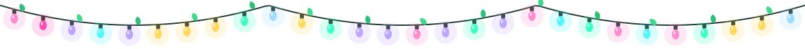

<p align="center"></p>

Creators, streamers, businesses, start-ups, gamers, influencers: whatever you're building, I can create your vision, your way. SFW and NSFW both welcome. 🌸

- 💻 **Full-Stack Web Development:** Next.js, React, TypeScript, APIs, auth and databases, from concept to launch.
- 🌌 **3D & Interactive Experiences:** Three.js, R3F, Framer Motion, particle fields and animated heroes. I make pages breathe.
- 🎮 **Custom Game Development:** browser, brand and giveaway games with Phaser, Babylon.js, Matter.js and more.
- 🎧 **Music & Sound in Code:** original soundtracks, jingles and SFX with the Web Audio API, Tone.js and Howler.js.
- 🤖 **Discord Bot Development:** custom bots, automation and community tooling.
- 🎨 **Graphic Design & Branding:** logos, stickers, custom art, social content and full brand kits. Photoshop master, Adobe Certified.
- ✂️ **Editorial & Content:** photo and video editing, menus, promos and ads, sharp and on-brand.
- 🪞 **Portfolio Creation:** bespoke portfolio pages, [just like mine](https://www.wland.online/Portfolios/Queen).
- 🧩 **Templates & Starter Designs:** ready-made page and game templates, or fully custom ones from scratch.
- 🧠 **AI Integration & Consulting:** 3+ years with AI tools, prompting and practical workflows.
- 🖋️ **Writing & Storytelling:** original fiction and custom stories, available directly through me.

> **Rates are flexible & budget-friendly.** Share your scope and timeline and we'll make it work. I especially love helping small businesses and start-ups get off the ground. 🌱

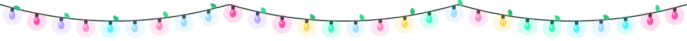

<p align="center"></p>

<p align="center">
  
  
</p>

<p align="center">
  
</p>

<details>
<summary><b>🧰 Click for my full toolkit</b></summary>
<br />

**Backend & tools:** TailwindCSS · Supabase · Contentful CMS · GraphQL · NextAuth · Node.js · Resend · Discord.js · Vanta.js · Vercel · PostgreSQL · React Email · Headless UI · Flowbite · Lucide React · Framer Motion · Tone.js · Howler.js · Web Audio API

**Also in my toolkit:** Ruby · PHP · Java · C++ · C# · Swift (basic) · HTML5 & CSS3 · Linux · Sharp · GitHub · Yarn / npm · Matter.js · EasyStar.js · Pathfinding.js · Simplex Noise · UUID · Browser Game Dev · Prompt Engineering · Social Media Strategy

</details>


<p align="center"></p>

Browser gaming is my specialty: arcade games, platformers, puzzle games, physics sandboxes and fully custom branded experiences. From tiny giveaway mini-games to polished multi-level productions, all running right in the browser with no downloads needed.

<p align="center">
  
  
</p>

<p align="center">
  <a href="https://www.wland.online/Portfolios/Queen#games"></a>
</p>

<p align="center"><b>🕹️ Four playable mini games live on my portfolio:</b> Rain Catcher (arcade) · Light Match (puzzle) · Kitty Rooftop Run (platformer) · Cozy Stack (Matter.js physics)</p>


<p align="center"></p>

Every song on my portfolio is original music **composed and synthesised in code**, right in the browser: clean guitar, electric piano, dreamy pads, bass and drums, all built note by note with the **Web Audio API**. I make custom soundtracks, jingles and sound effects for games, websites, streams, apps and brands.

<p align="center">
  <a href="https://www.wland.online/Portfolios/Queen#music"></a>
</p>


<p align="center"></p>

<p align="center">
  
  
</p>

<p align="center">
  
</p>

<p align="center">
  
</p>

<p align="center">
  
</p>

<p align="center">
  
</p>

<p align="center"><sub>Charts redraw themselves every day ✨ Most of my work lives in private client & company repos, so these only show part of the story.</sub></p>


<p align="center"></p>

- 🎓 **AA in Art Design**
- 🏅 **Adobe Certified Expert / Professional** · **Adobe Digital Publishing**
- 💾 **Computer Software & Applications** certification
- 🌐 **HTML** certification
- 🤖 **AI Prompt Engineering** courses
- 📚 Plus many more classes & courses. Full résumé available on request (serious inquiries only).

<details>
<summary><b>🖤 Click for the writer side of me</b></summary>
<br />

*"I write the stories that keep you up at night, and you wouldn't have it any other way."*

I write my own original fiction across dark romance, dark fantasy, romantic thriller, romantic mystery, sci-fi, yandere and short fiction. Some of my work has found a home through **WonderlandXXX** and **ShadowFang Media**, and I also offer **custom writing as a freelance service**. Commissions are open and handled personally. 🌹

</details>


<p align="center"></p>

<p align="center">I'm always open to inquiries. My schedule can be a bit unpredictable, but I'm friendly and happy to help when I can. I don't charge for simple questions or quick advice.</p>

<p align="center">
  <a href="https://www.wland.online/Portfolios/Queen"></a>
  <a href="mailto:ange@modulixsolutions.com"></a>
  <a href="mailto:ange.modulix@gmail.com"></a>
  
</p>

<p align="center">
  
</p>


<p align="center"><sub>Designed & built with love by Queen · WonderlandXXX Industries™</sub></p>
